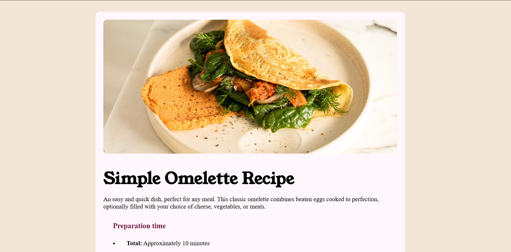

    

# Recipe page

Pagina de receitas 

## 🔥 Introdução

Criado com a finalidade de praticar conhecimentos em Front End.

 

## 📦 Tecnologias usadas:

* 
* 
 

## 👷 Autor

* **Rhuann Bittencourt** - *Frontend do projeto* - [Perfil Github](https://github.com/rhuanbittencourt)

 

 [Clique aqui para ver o projeto online](https://rhuanbittencourt.github.io/Recipe-page/)👆
